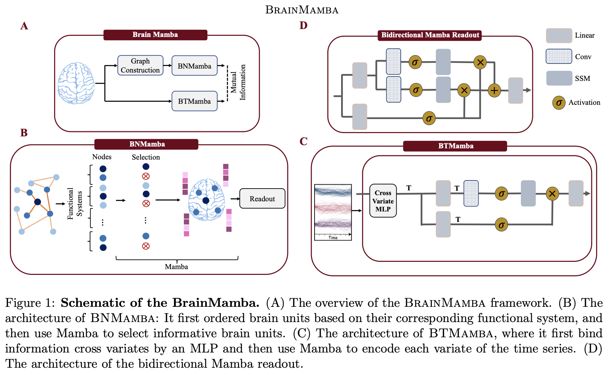

# BrainMamba

[](https://arxiv.org)





## Citation

If you find this work useful, please cite our paper:
```bibtex
@article{BrainMamba,
  title={Brain-Mamba: Encoding Brain Activity via Selective State Space Models},
  author={Behrouz, Ali and Hashemi, Farnoosh},
  journal={Conference on Health, Inference, and Learning (CHIL)},
  year={2024}
}
```
